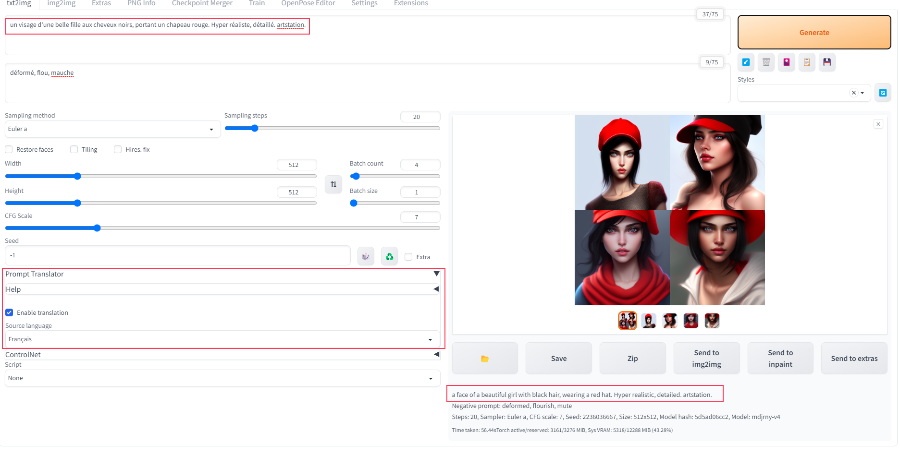

# prompt translator architecture

The main models currently used for offline translation are MarianMT and Mbart-50, with the latter providing somewhat
better results. This plugin uses the latter as the offline translation to translate the above sentence into English.

The offline translation performance of mBART-50 is superior to that of MarianMT, and it supports predefined translation words, incorporating a large vocabulary of architectural terms. Translate the above sentence into English.

Extension for [webui](https://github.com/AUTOMATIC1111/stable-diffusion-webui). Translate non-english to english in
stable diffusion webui.

Find the prompt translator tab after installing the extension.

# Installation

Install from webui's Extensions tab.

